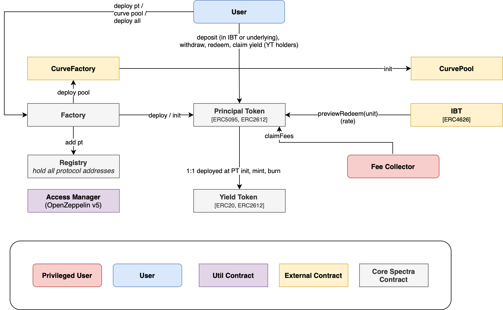

# Spectra core-v2

[](https://github.com/perspectivefi/core-v2/actions/workflows/testMain.yml)
[](https://docs.spectra.finance/) 
[](https://dev.spectra.finance) 

Spectra is an interest rate derivatives protocol for DeFi, with an easy-to-use flagship app.
Its high efficiency and customizable design stand out, enabling builders and users to use its architecture for their needs. Composability and a permissionless approach are at the core of Spectra's design philosophy. 

> For more information about the protocol, you can refer to the [protocol documentation](https://docs.spectra.finance/).

> To have a better understanding of how the contracts interact and behave please refer to the [developers doc](https://dev.spectra.finance)

- [Spectra core-v2](#spectra-core-v2)
  - [Architecture Overview](#architecture-overview)
    - [High Level Contracts Architecture](#high-level-contracts-architecture)
    - [Principal Token](#principal-token)
      - [Yield Token](#yield-token)
      - [Router](#router)
      - [Utils](#utils)
      - [Factory](#factory)
      - [Registry](#registry)
    - [Access Manager and Ownable](#access-manager-and-ownable)
  - [Installation](#installation)
  - [Submodules](#submodules)
  - [Compilation](#compilation)
  - [Testing](#testing)


## Architecture Overview

### High Level Contracts Architecture


### Principal Token

> *[PrincipalToken](./src/tokens/PrincipalToken.sol)*

This is the core contract of Spectra. The Principal Token is [EIP-5095](https://eips.ethereum.org/EIPS/eip-5095) and [EIP-2612](https://eips.ethereum.org/EIPS/eip-2612) compliant. Users can deposit an [EIP-4626](https://eips.ethereum.org/EIPS/eip-4626) IBT or the underlying token of that IBT and receive Principal Tokens (PT) and Yield Tokens (YT). The PT contract holds the logic that separates the yield generated from the principal asset deposited in the IBT.


#### Yield Token

> *[YieldToken](./src/tokens/YieldToken.sol)*

This contract represents the Yield Token (YT). The YT is an [EIP-20](https://eips.ethereum.org/EIPS/eip-20) token and follows the [EIP-2612](https://eips.ethereum.org/EIPS/eip-2612) standard. The same amount of PT and YT is minted upon depositing into the protocol (`PrincipalToken.deposit`, `PrincipalToken.depositIBT`). The YT captures the yield generated by the deposited principal. Holding the YT allows the user to claim the corresponding amount of yield generated by the IBTs deposited in the associated PT contract.


#### Router

> *[Router](./src/router/Router.sol)*

This is a utility contract designed to perform operations like swapping in a Curve pool, adding/removing liquidity and wrapping/unwrapping of PTs and ERC4626 IBTs. It also includes utility functions for simulating a sequence of operations with a specified input amount, as well as an absolute simulation that does not account for fees and slippage.

#### Utils

> *[PrincipalTokenUtil](src/libraries/PrincipalTokenUtil.sol), [CurvePoolUtil](src/libraries/CurvePoolUtil.sol), [CurveNGPoolUtil](src/libraries/CurveNGPoolUtil.sol), [Roles](src/libraries/Roles.sol), [NamingUtil](src/libraries/NamingUtil.sol)*

Different libraries are used to perform calculation and recurrent PT operations, or the naming of the tokens created by the protocol. The `Roles` library hold the list of Roles IDs used by the [Access Manager](#access-manager-and-ownable). The `CurvePoolUtil` and `CurveNGPoolUtil` libraries hold some logic for computations and interactions with Curve CryptoSwap pools and TwoCrypto-NG pools respectively.

#### Factory

> *[Factory](./src/factory/Factory.sol)*

This is the contract which is used to deploy PTs and Curve pools. Upon deployment, the factory will register the new contracts in the registry.


#### Registry

> *[Registry](./src/Registry.sol)*

This contract stores protocol addresses such as the Factory, Router and PTs. It also maintains fee values.

### Access Manager and Ownable

The Spectra protocol implements the [OpenZeppelin AccessManager](https://docs.openzeppelin.com/contracts/5.x/api/access#accessmanager).

The following roles are defined:
- `ADMIN_ROLE` - roleId `0` - the Access Manager super admin. Can grant and revoke any role. Set by default in the Access Manager constructor.
- `UPGRADER_ROLE` - roleId `1` - the users who can upgrade the protocol implementations.
- `PAUSER_ROLE` - roleId `2` - the DAO address that can pause the protocol (in case of emergency).
- `FEE_SETTER_ROLE` - roleId `3` - the role that can change the fees in the protocol.
- `REGISTRY_ROLE` - roleId `4` - the users who can call the registry contract to register new contracts addresses.

## Installation

Follow [this link](https://book.getfoundry.sh/getting-started/installation) to install Foundry, Forge, Cast and Anvil

Do not forget to update Foundry regularly with the following command

```properties
foundryup
```

Similarly for forge-std run

```properties
forge update lib/forge-std
```

## Submodules

Run below command to include/update all git submodules like openzeppelin contracts, forge-std etc (`lib/`)

```properties
git submodule update --init --recursive
```

To get the `node_modules/` directory run

```properties
yarn
```

## Compilation

To compile your contracts run

```properties
forge build
```

## Testing

Run your tests with

```properties
forge test
```

Find more information on testing with foundry [here](https://book.getfoundry.sh/forge/tests)

Note: tests might take a long time to complete due to the number of fuzz runs. You can modify the `runs` parameter under the `[fuzz]` section of the `foundry.toml` file as per your needs.
